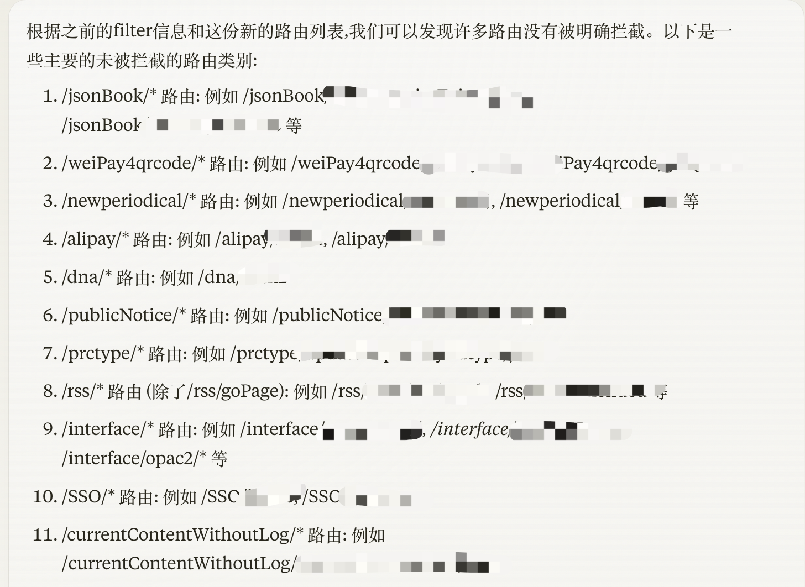
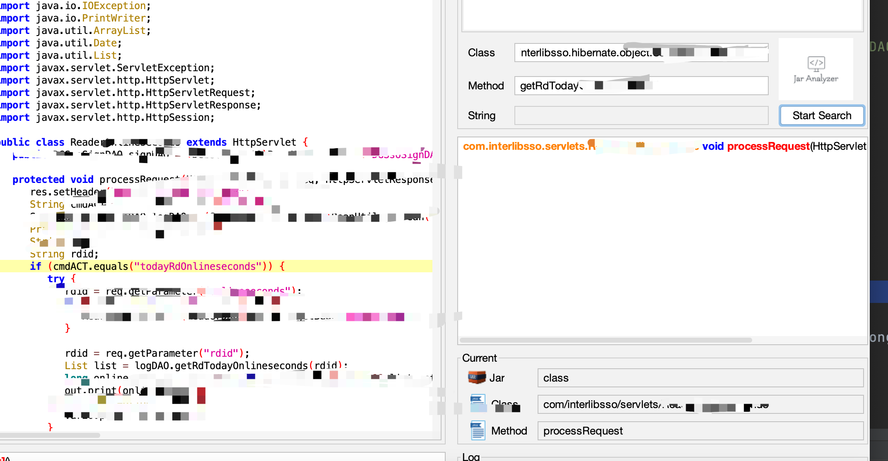

## 使用RouteCheck挖掘某图书管理系统


RouteCheck项目地址https://github.com/ax1sX/RouteCheck-Alpha，


在攻防演练的时候发现很多靶标都在用某软件开发商的图书管理系统和资源外访问系统

项目目录大致如下

```
├── WEB-INF
│   ├── classes
│   ├── i18n
│   ├── lib
│   ├── opac.tld
│   ├── spring-core.xml
│   ├── spring-form.tld
│   ├── spring-servlet.xml
│   ├── spring.tld
│   ├── tiles.xml
│   ├── web.xml
│   └── config.properties
├── jsp_tiles
├── solr_conf
└── static
```


打开他的web.xml就饱了，写了一片，有用的没几个，没用的倒是一大堆，主要就是写了个authorityFilter对一些路由进行鉴权

```
    <filter-name>authorityFilter</filter-name>
    <url-pattern>/reader/reportxxxx</url-pattern>
  </filter-mapping>
  <filter-mapping>
    <filter-name>authorityFilter</filter-name>
    <url-pattern>/reader/setReceivexxxxxxx</url-pattern>
  </filter-mapping>
  <filter-mapping>
    <filter-name>authorityFilter</filter-name>
    <url-pattern>/reader/getReceivxxxxx</url-pattern>
  </filter-mapping>
  <filter-mapping>
```

直接看看历史漏洞怎么写的

历史漏洞说是WebBookNew接口存在sql注入

```
GET /xxxxxxx/webxxxx/WebBookNew?cmdACT=search_BookNew&showpage=1&filter=''+or+1=1--+ HTTP/1.1
Host: 
```

打开jar-analyzer把文件放进去跑一哈然后搜索就出来了

漏洞文件在一个jar包里面大致代码如下

```
public class WebBookNew extends HttpServlet {
   protected void processRequest(HttpServletRequest var1, HttpServletResponse var2) throws ServletException, IOException {
      String var4 = var1.getParameter("cmdACT");
      
当cmdACT为search_BookNew时

                  if (var4.equals("search_BookNew")) {
                     var15 = var1.getParameter("filter");
                     var16 = var1.getParameter("cataname");
                     var104 = new Integer(var1.getParameter("showpage")) - 1;
                     var105 = "select a.*,a.rowid from book_new a where xxxxx=" + var16 + var15 + " xxxx";
                     可以看到直接将filter和cataname直接拼接进去了
```

在看完webbooknew后我把同目录下的文件打开扫了一眼发现也有sql注入，但是我还不知道刚才路由的第二个目录的路径是在哪配置的，这个web.xml除了filter一点有用的都没有，在项目里搜了半天都没找到，于是我直接用之前WebBookNew前面的的路由加上其他接口的名字来访问，结果全是404，寄辣！！！


不过刚才在web.xml都是对WEB-INF/classes/com/xxxxxx/opac/controller下的文件路由做的鉴权所以继续去看一下这些controller，但在此之前需要先看一下如何访问，

在WEB-INF/classes/index.properties里面配置了GLOBAL_OPAC_BASEURL=http://localhost/opac 

opac的基础路由就是opac，直接opac+controller的路由即可访问


不过由于这个web.xml的filter要鉴权路由实在是写的太多了，所以直接拿Routecheck跑一下项目的访问路由，将filter要鉴权的和controller中的路由放入gpt直接问哪些没有被拦截

```
/jsonAnalytics/*	com.xxxxx.opac.filter.CrossFilter	
/admin/systemOption/*	com.xxxxxx.opac.filter.AdminAuthorityFilter	
/admin	com.xxxxx.opac.filter.AdminAuthorityFilter	
/admin/weixin/*	com.xxxxx.opac.filter.AdminAuthorityFilter	
/admin/raffle/*	com.xxxxx.opac.filter.AdminAuthorityFilter	
/admin/BGSearch/*	com.xxxxxx.opac.filter.AdminAuthorityFilter	
/currentContent/*	com.xxxxxx.opac.filter.AdminAuthorityFilter	
/admin/faq/*	com.xxxxxx.opac.filter.AdminAuthorityFilter	
/admin/prompt/*	com.xxxxxx.opac.filter.AdminAuthorityFilter	
/admin/bookSpecial/*	com.xxxxx.opac.filter.AdminAuthorityFilter	
/admin/sysconfig/*	com.xxxxxx.opac.filter.AdminAuthorityFilter
.....
```





记录未经鉴权的路由后开始打开controller看一下

```
  @RequestMapping({"/weixin/xxxxxx/xxxx"})
    public String list(@RequestParam String openid, Model model) {
        List<WeixinConsult> consults = this.weixinConsultxxxxx.getTopConsultsByOpenid(openid);
        model.addAttribute("consults", consults);
        
            public List<WeixinConsult> getTopConsultsByOpenid(String openid) {
        String sql = "select * from Weixin_Consult where openid= '" + openid + "' and parent_id=0 order by submit_time desc";
        List query = this.jdbcTemplate.query(sql, new ObjectRowMapper(WeixinConsult.class));
        return query;
    }
```


资源外访问系统


大致目录结构如下

```
├── WEB-INF
│   ├── classes
│   ├── lib
│   ├── web.xml
│   └── weblogic.xml
├── admin
├── interface
├── main
├── mobile
├── newMobile

classes目录下
├── api
├── filter
├── hibernate
```


Weblogic.xml配置了项目根路径

```
    <context-root>/interlibSSO</context-root>
```


项目通过hibernate进行sql查询,直接打开hibernate下的xxxDao文件，当找到直接拼接的可以在jar-analyzer里面查找方法调用

```
    public List getRdTodayxxxxxxxxxx(String rdid) throws Exception {
        String queryString = "select sum(onlineseconds) from Ssoreaderlogtable where to_char(regtime,'yyyymmdd')=to_char(sysdate,'yyyymmdd') and rdid = '" + rdid + "'";
        List list = this.getHibernateTemplate().find(queryString);
        return list;
    }
```


